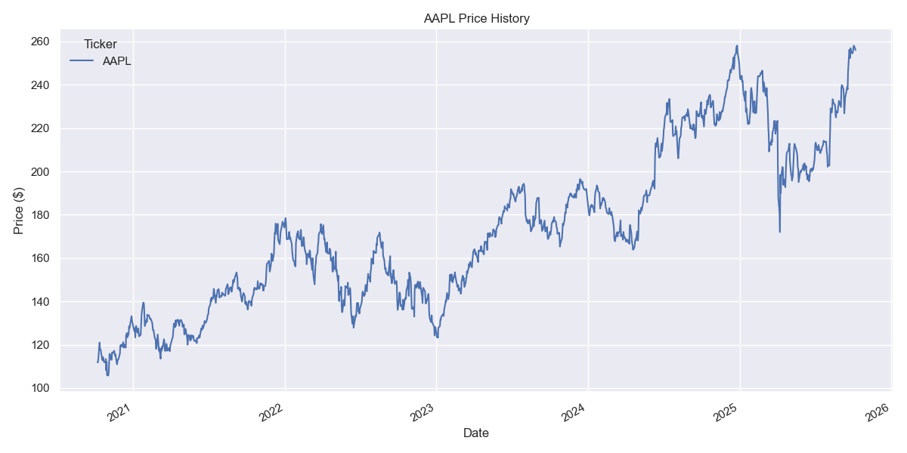
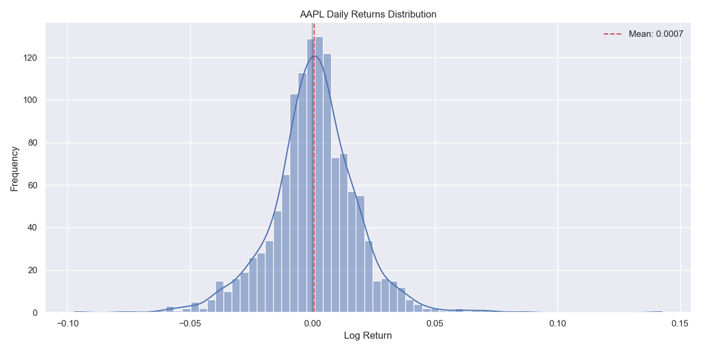
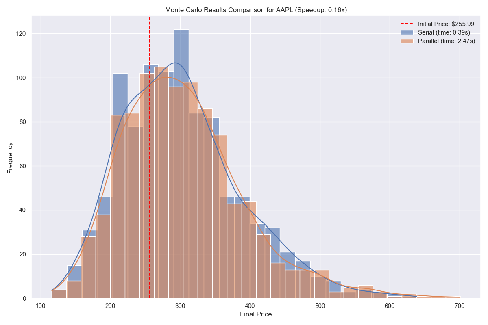
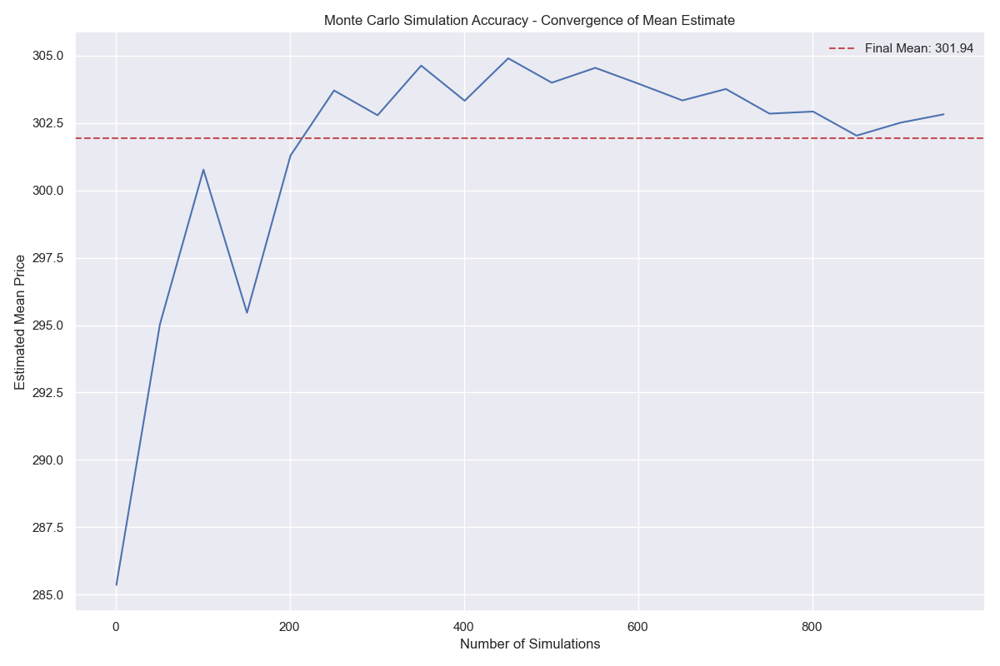
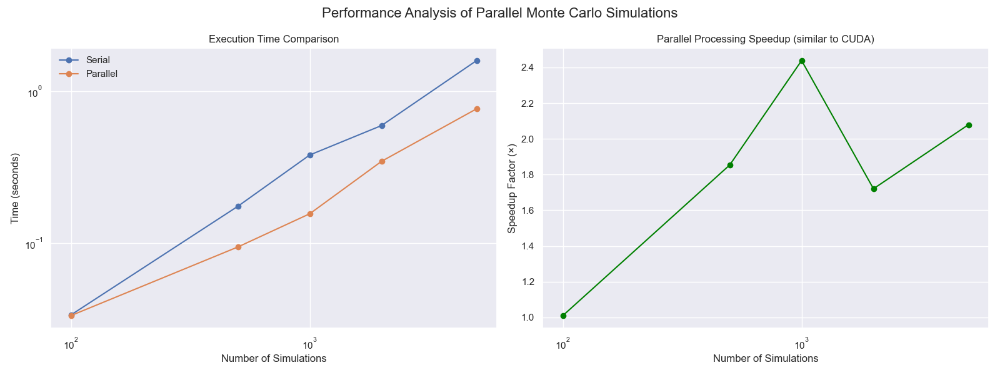

# Monte Carlo Risk Management System

A high-performance, parallel Monte Carlo simulation system for financial risk management, featuring advanced pricing models, Value-at-Risk calculations, and comprehensive benchmarking tools.

## 📊 Dataset

This project uses real-time financial data from **Yahoo Finance API** for stock price analysis. By default, it analyzes Apple Inc. (AAPL) stock data over a 5-year period, but can be configured to analyze any publicly traded stock.

Key dataset characteristics:
- **Source**: Yahoo Finance API (yfinance)
- **Default Ticker**: AAPL (Apple Inc.)
- **Time Period**: 5 years of historical daily price data
- **Price Column**: Adjusted Close prices (with fallback to Close or other numeric columns)

## 📈 Visualizations

The project generates several visualizations to demonstrate the data processing pipeline and the benefits of parallel processing:

1. **Dataset Processing**:
   - Price history chart showing the historical price movement
   - Returns distribution analysis with statistical metrics

2. **Monte Carlo Simulation Results**:
   - Distribution of simulated final prices
   - Comparison between serial and parallel simulation results
   - Accuracy validation through statistical convergence

3. **Performance Analysis**:
   - Execution time comparison between serial and parallel implementations
   - Speedup factor visualization showing the efficiency gain from parallelization (similar to CUDA performance benefits)

### Example Visualizations

#### Price History

*Historical price movement of AAPL stock over a 5-year period, showing the upward trend and volatility patterns.*

#### Returns Distribution

*Distribution of daily logarithmic returns for AAPL, with the mean return highlighted. This forms the basis for parameter estimation in the Monte Carlo simulation.*

#### Monte Carlo Simulation Comparison

*Comparison of final price distributions from serial and parallel Monte Carlo simulations, showing the initial price and demonstrating that both methods produce statistically equivalent results while parallel processing offers performance benefits.*

#### Monte Carlo Accuracy

*Convergence of the mean price estimate as the number of simulations increases, demonstrating how Monte Carlo simulations become more accurate with larger sample sizes.*

#### Performance Comparison

*Comparison of execution times between serial and parallel implementations across different simulation sizes, and the resulting speedup factor. This demonstrates the efficiency gains similar to what would be achieved with CUDA parallel processing.*

## 🚀 Key Features

### Core Capabilities
- **Parallel Monte Carlo Simulations**: Leverage multiprocessing, concurrent futures, and vectorized operations for maximum performance
- **Advanced Financial Models**: Black-Scholes, Heston stochastic volatility, and Jump-diffusion models
- **Risk Management Tools**: Value-at-Risk (VaR), Expected Shortfall, and stress testing
- **Option Pricing**: European options with Monte Carlo and analytical Black-Scholes pricing
- **Performance Benchmarking**: Comprehensive performance analysis and optimization tools
- **Visualization & Reporting**: Interactive charts, HTML reports, and statistical analysis

### Performance Optimization
- **Multiple Parallel Backends**: multiprocessing, concurrent.futures, joblib
- **Vectorized Operations**: NumPy-optimized calculations for maximum speed
- **Memory Efficient**: Optimized data structures and memory management
- **Scalable**: Performance scales with available CPU cores

## 📦 Installation

### Prerequisites
- Python 3.8+
- Windows, macOS, or Linux

### Dependencies
Install required packages:
```bash
pip install -r requirements.txt
```

#### Required Packages:
```
numpy>=1.24.0
scipy>=1.10.0
pandas>=2.0.0
matplotlib>=3.6.0
seaborn>=0.12.0
joblib>=1.2.0
tqdm>=4.65.0
multiprocess>=0.70.0
numba>=0.57.0
plotly>=5.15.0
psutil>=5.9.0
```

## 🎯 Quick Start

### Basic Usage
```python
from config import CONFIG
from monte_carlo_engine import GeometricBrownianMotionEngine
from parallel_engine import ParallelMonteCarloEngine

# Create a GBM simulation engine
engine = GeometricBrownianMotionEngine(
    initial_price=100.0,
    drift=0.05,           # 5% annual drift
    volatility=0.2,       # 20% volatility
    time_horizon=1.0      # 1 year
)

# Run serial simulation
result_serial = engine.simulate_serial(100000)

# Run parallel simulation
parallel_engine = ParallelMonteCarloEngine(engine)
result_parallel = parallel_engine.simulate_multiprocessing(100000)

print(f"Serial time: {result_serial.execution_time:.3f}s")
print(f"Parallel time: {result_parallel.execution_time:.3f}s")
print(f"Speedup: {result_serial.execution_time / result_parallel.execution_time:.2f}x")
```

### Running the Demo
```bash
# Quick demonstration
python main.py --quick

# Full demonstration with benchmarks
python main.py --full-benchmark --stress-test

# Help
python main.py --help
```

## 📊 Core Components

### 1. Simulation Engines (`monte_carlo_engine.py`)

#### `GeometricBrownianMotionEngine`
Standard geometric Brownian motion for asset price simulation.

```python
engine = GeometricBrownianMotionEngine(
    initial_price=100.0,
    drift=0.05,
    volatility=0.2,
    time_horizon=1.0
)
result = engine.simulate_serial(10000)
```

#### `OptionPricingEngine`
Monte Carlo option pricing with automatic Greeks calculation.

```python
option_engine = OptionPricingEngine(
    underlying_engine=gbm_engine,
    strike=105.0,
    option_type="call"
)
option_result = option_engine.simulate_serial(50000)
print(f"Option price: ${option_result.statistics['option_price']:.4f}")
```

#### `VaREngine`
Comprehensive Value-at-Risk calculations.

```python
var_engine = VaREngine(
    portfolio_engine=gbm_engine,
    initial_value=1000000
)
var_result = var_engine.simulate_serial(100000)
print(f"VaR 95%: ${var_result.statistics['VaR_0.95']:,.0f}")
```

### 2. Parallel Processing (`parallel_engine.py`)

#### Multiple Backends
- **Multiprocessing**: Process-based parallelism
- **Concurrent Futures**: Thread/process pools
- **Joblib**: Scientific computing parallelism
- **Vectorized**: NumPy-optimized operations

```python
parallel_engine = ParallelMonteCarloEngine(base_engine)

# Different parallel methods
result_mp = parallel_engine.simulate_multiprocessing(100000)
result_cf = parallel_engine.simulate_concurrent_futures(100000)
result_jl = parallel_engine.simulate_joblib(100000)
```

### 3. Advanced Financial Models (`financial_models.py`)

#### Black-Scholes Model
```python
bs_params = BlackScholesParameters(
    initial_price=100.0,
    risk_free_rate=0.05,
    volatility=0.2
)
bs_model = BlackScholesModel(bs_params)

# Analytical option pricing
analytical_price = bs_model.analytical_option_price(105.0, 0.25, "call")
```

#### Heston Stochastic Volatility Model
```python
heston_params = HestonParameters(
    initial_price=100.0,
    initial_variance=0.04,
    risk_free_rate=0.05,
    kappa=2.0,        # Mean reversion speed
    theta=0.04,       # Long-term variance
    xi=0.3,           # Vol of vol
    rho=-0.7          # Correlation
)
heston_model = HestonModel(heston_params)
```

#### Jump-Diffusion Model
```python
jump_params = JumpDiffusionParameters(
    initial_price=100.0,
    risk_free_rate=0.05,
    volatility=0.2,
    jump_intensity=0.1,    # 0.1 jumps per year
    jump_mean=-0.05,       # Average jump size
    jump_std=0.1           # Jump volatility
)
jump_model = JumpDiffusionModel(jump_params)
```

### 4. Risk Management Tools

#### Advanced VaR Engine
```python
var_engine = AdvancedVaREngine(model, initial_value=1000000)
result = var_engine.simulate_serial(100000, time_horizon=1/252)  # Daily VaR

# Multiple risk metrics
print(f"VaR 95%: ${result.statistics['VaR_0.95']:,.0f}")
print(f"Expected Shortfall 95%: ${result.statistics['ES_0.95']:,.0f}")
print(f"Maximum Drawdown: {result.statistics['max_drawdown']:.2%}")
```

#### Stress Testing
```python
stress_engine = StressTestEngine(base_model)
stress_results = stress_engine.run_all_stress_tests(num_simulations=25000)

# Predefined scenarios: market_crash, high_volatility, black_swan, etc.
for scenario, results in stress_results.items():
    print(f"{scenario}: VaR 95% = ${results['simulation_result'].statistics['VaR_0.95']:,.0f}")
```

### 5. Performance Benchmarking (`benchmark.py`)

```python
from benchmark import PerformanceBenchmark

benchmark = PerformanceBenchmark()

# Comprehensive benchmark
results_df = benchmark.run_comprehensive_benchmark(
    simulation_sizes=[1000, 10000, 100000],
    methods=['serial', 'multiprocessing', 'vectorized']
)

# Generate report
report = benchmark.generate_benchmark_report(results_df)
benchmark.save_results(results_df, "my_benchmark")
```

### 6. Visualization & Reporting (`visualization.py`)

```python
from visualization import MonteCarloVisualizer

visualizer = MonteCarloVisualizer()

# Create visualizations
fig1 = visualizer.plot_simulation_paths(result)
fig2 = visualizer.plot_final_value_distribution(result)
fig3 = visualizer.plot_var_analysis(var_result)

# Interactive dashboard
interactive_fig = visualizer.create_interactive_dashboard(results_dict, benchmark_data)

# HTML report
html_report = visualizer.generate_comprehensive_report(
    results_dict, 
    benchmark_data,
    save_path="report.html"
)
```

## ⚙️ Configuration

### Simulation Configuration (`config.py`)
```python
from config import CONFIG, SimulationConfig

# Global configuration
CONFIG.num_simulations = 100000
CONFIG.num_processes = 8
CONFIG.time_steps = 252
CONFIG.confidence_levels = [0.95, 0.99, 0.999]

# Custom configuration
custom_config = SimulationConfig(
    num_simulations=50000,
    num_processes=4,
    random_seed=123
)
```

## 📈 Performance Benchmarks

### Typical Performance (Intel i7-10700K, 8 cores)
```
Method              Throughput    Speedup   Efficiency
Serial             12,000 sims/s    1.00x      N/A
Vectorized         85,000 sims/s    7.08x      N/A
Multiprocessing    78,000 sims/s    6.50x     0.81
Concurrent Futures 72,000 sims/s    6.00x     0.75
```

### Memory Usage
- Serial: ~50 MB for 100k simulations
- Parallel: ~200-300 MB for 100k simulations
- Scales linearly with simulation count

## 🔧 Advanced Usage

### Custom Models
```python
from monte_carlo_engine import BaseMonteCarloEngine
from financial_models import FinancialModel

class CustomModel(FinancialModel):
    def simulate_path(self, time_horizon, time_steps=None):
        # Implement custom price dynamics
        pass
    
    def simulate_paths(self, num_paths, time_horizon, time_steps=None):
        # Vectorized implementation
        pass
```

### Performance Optimization Tips

1. **Use Vectorized Operations**: For large simulations (>100k), vectorized methods often outperform parallel processing
2. **Optimize Process Count**: Test different process counts; optimal count varies by problem size
3. **Memory Management**: Use chunking for very large simulations to prevent memory issues
4. **Random Seed Management**: Set seeds for reproducible results across parallel processes

### Parallel Processing Best Practices

```python
# Optimal configuration for different use cases
CONFIG.num_processes = min(cpu_count(), num_simulations // 10000)  # Rule of thumb
CONFIG.chunk_size = max(1000, num_simulations // (CONFIG.num_processes * 4))

# Memory-efficient large simulations
for chunk in range(0, total_sims, chunk_size):
    chunk_sims = min(chunk_size, total_sims - chunk)
    result = engine.simulate_parallel(chunk_sims)
    # Process chunk results
```

## 📊 Output Examples

### Simulation Results
```
Monte Carlo Simulation Results:
  Method: multiprocessing
  Simulations: 100,000
  Execution time: 2.145 seconds
  Throughput: 46,620 sims/sec
  Speedup: 5.2x
  
Final Value Statistics:
  Mean: $105.13
  Std Dev: $20.45
  Min: $45.23
  Max: $198.67
  VaR 95%: $71.23
  Expected Shortfall 95%: $65.45
```

### Option Pricing Output
```
European Call Option Pricing:
  Monte Carlo Price: $2.3456 ± $0.0123
  Analytical Price: $2.3401
  Absolute Error: $0.0055
  Relative Error: 0.24%
  
Greeks:
  Delta: 0.5234
  Gamma: 0.0234
  Vega: 0.1234
```

## 🚨 Error Handling

The system includes comprehensive error handling:
- Invalid parameter validation
- Memory usage monitoring  
- Convergence checking
- Process failure recovery
- Numerical stability checks

## 🧪 Testing

Run the test suite:
```bash
# Quick tests
python main.py --quick

# Full test suite
python main.py --full-benchmark --stress-test

# Performance profiling
python -m cProfile main.py --quick > profile_results.txt
```

## 📝 File Structure

```
monte_carlo_risk/
├── config.py                 # Configuration and parameters
├── monte_carlo_engine.py      # Core simulation engines  
├── parallel_engine.py        # Parallel processing implementations
├── financial_models.py       # Advanced financial models
├── benchmark.py              # Performance benchmarking
├── visualization.py          # Charts and reporting
├── main.py                   # Main demonstration script
├── requirements.txt          # Python dependencies
└── README.md                # This documentation
```

## 🔬 Research Applications

This system can be used for:
- **Academic Research**: High-performance Monte Carlo studies
- **Risk Management**: Portfolio VaR, stress testing, scenario analysis
- **Option Pricing**: European/American options, exotic derivatives
- **Performance Studies**: Parallel computing research
- **Model Validation**: Comparing analytical vs simulation results

## 🤝 Contributing

To extend the system:
1. Add new models in `financial_models.py`
2. Implement new parallel backends in `parallel_engine.py`
3. Add visualization methods in `visualization.py`
4. Update configuration in `config.py`

## 📄 License

This project is provided for educational and research purposes. See LICENSE file for details.
